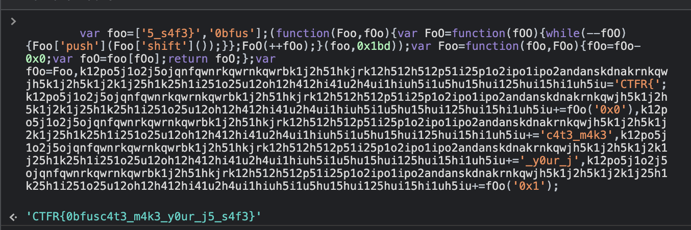

# Challenge Name: JS Obfuscate #1


## Description

Apa itu Obfuscate, Kurang lebih mimin jelaskan singkat. Obfuscate itu sama saja melakukan pelindungan kepada Teks / Enkripsi akan tetapi bisa di Decode / De-obfuscate, Bahkan kode saja bisa di Obfuscate termasuk JS, nah coba cek link dibawah ini dan cari cara untuk De-Obfuscate.

## Attached Files

\-

## Solution

terdapat javascript terencrypt, kita coba copy, paste ke console.
dan dapatlah flagnya

```html
<script>
  var foo = ["5_s4f3}", "0bfus"];
  (function (Foo, fOo) {
    var FoO = function (fOO) {
      while (--fOO) {
        Foo["push"](Foo["shift"]());
      }
    };
    FoO(++fOo);
  })(foo, 0x1bd);
  var Foo = function (fOo, FOo) {
    fOo = fOo - 0x0;
    var foO = foo[fOo];
    return foO;
  };
  var fOo = Foo,
    k12po5j1o2j5ojqnfqwnrkqwrnkqwrbk1j2h51hkjrk12h512h512p51i25p1o2ipo1ipo2andanskdnakrnkqwjh5k1j2h5k1j2k1j25h1k25h1i251o25u12oh12h412hi41u2h4ui1hiuh5i1u5hu15hui125hui15hi1uh5iu =
      "CTFR{";
  (k12po5j1o2j5ojqnfqwnrkqwrnkqwrbk1j2h51hkjrk12h512h512p51i25p1o2ipo1ipo2andanskdnakrnkqwjh5k1j2h5k1j2k1j25h1k25h1i251o25u12oh12h412hi41u2h4ui1hiuh5i1u5hu15hui125hui15hi1uh5iu +=
    fOo("0x0")),
    (k12po5j1o2j5ojqnfqwnrkqwrnkqwrbk1j2h51hkjrk12h512h512p51i25p1o2ipo1ipo2andanskdnakrnkqwjh5k1j2h5k1j2k1j25h1k25h1i251o25u12oh12h412hi41u2h4ui1hiuh5i1u5hu15hui125hui15hi1uh5iu +=
      "c4t3_m4k3"),
    (k12po5j1o2j5ojqnfqwnrkqwrnkqwrbk1j2h51hkjrk12h512h512p51i25p1o2ipo1ipo2andanskdnakrnkqwjh5k1j2h5k1j2k1j25h1k25h1i251o25u12oh12h412hi41u2h4ui1hiuh5i1u5hu15hui125hui15hi1uh5iu +=
      "_y0ur_j"),
    (k12po5j1o2j5ojqnfqwnrkqwrnkqwrbk1j2h51hkjrk12h512h512p51i25p1o2ipo1ipo2andanskdnakrnkqwjh5k1j2h5k1j2k1j25h1k25h1i251o25u12oh12h412hi41u2h4ui1hiuh5i1u5hu15hui125hui15hi1uh5iu +=
      fOo("0x1"));
</script>
```

## Screen Shoot



---

[Back to home](/CTFR/Web/)
