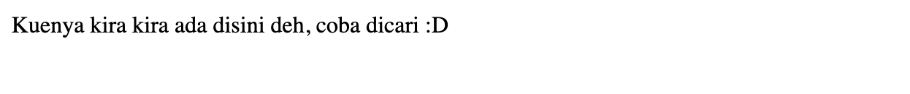

# Challenge Name: Kue


## Description

Mimin taruh kue di website yang dibawah ini nih, cuman lupa naruhnya dimana :( Coba tolong carikan yaa para heker

## Attached Files

\-

## Solution

Diberikan sebuah deskripsi untuk mencari kue, dalam bahasa inggris kue adalah cookie, untuk mendaptakan cookie dari website 2 cara, yaitu menggunakan tools [Cookie Editor](https://chrome.google.com/webstore/detail/cookie-editor/hlkenndednhfkekhgcdicdfddnkalmdm) atau menggunakan command

```bash
curl --head -s https://web.ctf.rasyidmf.com/chal3/ | awk '/set-cookie: flag=/{print $2}' | sed 's/flag=//g' | python3 -c "import sys; from urllib.parse import unquote; print(unquote(sys.stdin.read()));" | sed 's/\;//g'
```

## Screen Shoot




