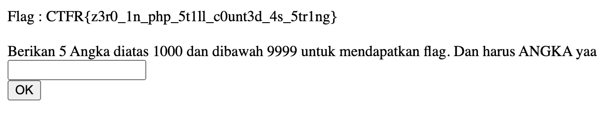

# Challenge Name: Numeric Influence

## Description

Diberikan sebuah skrip yang hanya menerima inputan "Berikan 5 Angka diatas 1000 dan dibawah 9999 untuk mendapatkan flag". Coba cari tahu gimana yaa caranyaaa

## Attached Files

\-

## Solution

dari deskripsi soal dijelaskan hanya angka dan 5 angka diatas 1000 dibawah 9999, maka saya akan menginput **01001**, dikarenakan angka 0 diawal akan tidak dinggap, sehingga menjadi 1001, dapatlah flagnya

## Screen Shoot

---

[Back to home](/CTFR/Web/)
