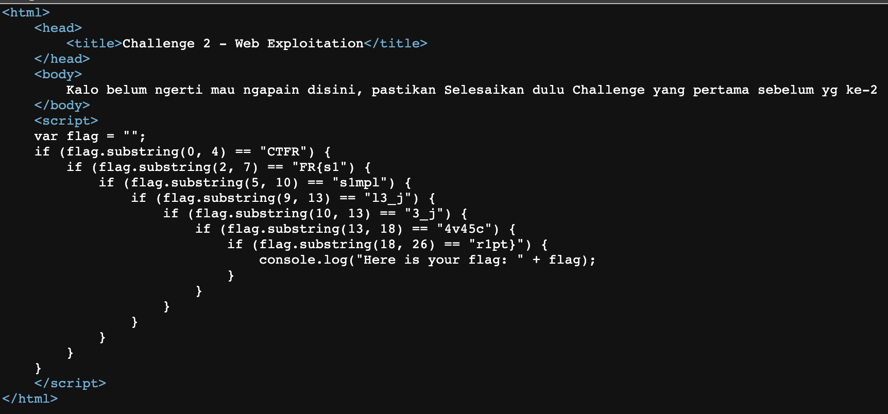
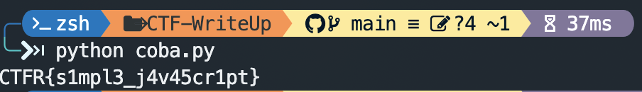

# Challenge Name: Substring JS


## Description

Masih lanjut dengan challenge website yang s1mpel deh, Kalo belum tau apa itu Substring pada Javascript, di google ada banyak kok tentang ilmu itu jadi jangan malas buat nyari yaaa :D

## Attached Files

\-

## Solution

pada gambar pertama, terdapat sebuah code substring JavaScript dan juga flag yang terpisah.
terhubung saya malas manual saya buat script menggunakan python untuk mendapatkan flagnya

```python
import requests
import re

r = requests.get('https://web.ctf.rasyidmf.com/chal2')
response = r.text

regex = r"flag\.substring\((.*), (.*)\) == \"(.*?)\""
matchAll = re.findall(regex, response)
flag = list('')

for match in matchAll:
    flag[int(match[0]):int(match[1])] = match[2]

print(''.join(flag))
```

## Screen Shoot




