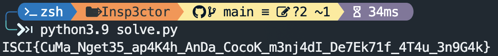

# Challenge Name: Insp3ctor


## Description

Download this file to view and open the challenge.

## Attached Files

\-

## Solution

flag tersebut terpisah setiap file, untuk mengeselesaikan chall tersebut bisa manual maupun menggunakan python

```python
import requests
import re

def init():
    r = requests
    return Request(r), r

class Request:
    def __init__(self, r: requests):
        self.r = r

    def redirect(self, url, flagkeberapa):
        r = self.r

        response = r.get(url).text
        return self.getFlag(response, flagkeberapa)

    def getFlag(self, response, flagkeberapa):
        regex = r"(<!-- Flag : (.*) -->|\/\* Flag : (.*?) \*\/|\/\/ (.*))"
        flag = re.findall(regex, response)

        indexFlag = 1 if flagkeberapa == 1 else 2 if flagkeberapa == 2 else 3
        return flag[0][indexFlag]

    def exploit(self):
        r = self.r
        flag = []
        files = ['', 'style.css', 'script.js']

        for i, file in enumerate(files, start=0):
            flag.append(self.redirect(f"https://gleeful-otter-0ededd.netlify.app/{file}", i+1))

        print(''.join(flag))


if __name__ == "__main__":
    x, y = init()
    x.exploit()
```

## Screen Shoot



---

[Back to home](/ISCI/)
